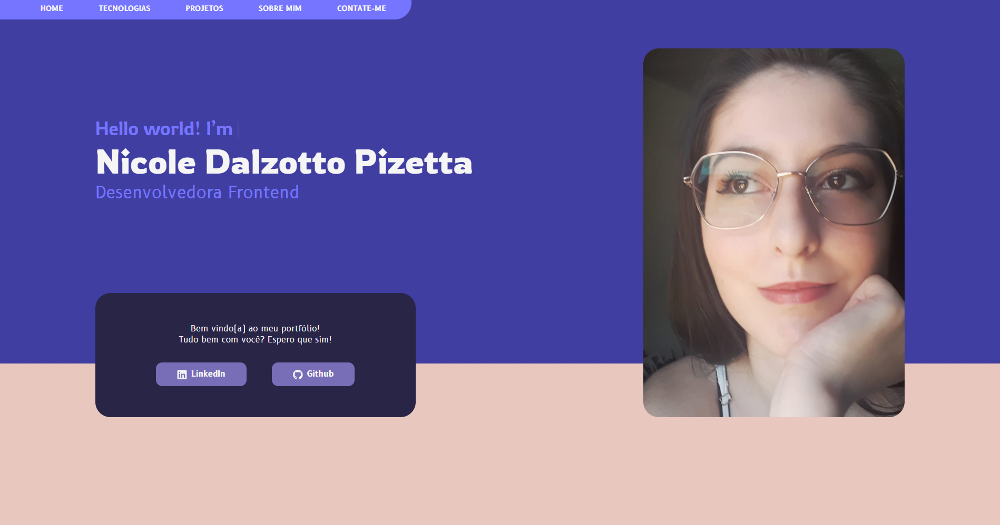

<h1 align="center"> Portfolio de Nicole Dalzotto Pizetta </h1>

BR: Minha página web pessoal de apresentação profissional.  
EN: My professional presentation personal web page.

 

## 🌸 Preview site

- [Preview](https://nicoledpizetta.github.io/Portfolio-HTML-CSS-JSVanilla/)

## 🌸 Futuras atualizações | Future improvements

BR: Está é a primeira versão do portfólio, ainda não completamente otimizada como desejo e temporariamente apenas com o layout para Desktop.

**Melhorias planejadas:**

- Versão de layout para Mobile; _(trabalho em andamento)_
- Torná-lo responsivo em mais dispostivos; _(trabalho em andamento)_
- Adicionar um formulário de Contato na própria página, sem dependender do Google Forms como link externo.

**Melhorias ainda a serem decididas se serão implementadas ou não:**

- Talvez adicionar um toggle para a versão em inglês.
   
   

EN: This is the first version, not completly otimized as I want and temporarily with only Desktop layout.

**Planned improvements:**

- Mobile layout version; _(work in progress)_
- Make responsive to more devices; _(work in progress)_
- Add a Contact form to the page, without depending on Google Forms external link.

**Improvements still to be decided whether to implement or not:**

- Maybe add a toggle for the english version.

## 🌸 Screenshots

#### Desktop

#### Mobile

trabalho em andamento / work in progress  

 

## 🌸 Tecnologias | Technologies

BR: Esse projeto foi desenvolvido com as seguintes tecnologias:

EN: This project was developed with the following technologies:

- HTML5
- Semantic HTML5 markup
- CSS3
- CSS custom properties
- CSS animations
- CSS Flexbox
- CSS Grid
- Git e Github
- Figma

## :memo: Licença | License

BR: Proibida a utilização e/ou reprodução dos arquivos para fins diferentes de aprendizado.

EN: Proibida a utilização e/ou reprodução dos arquivos para fins diferentes de aprendizado.

---

 Make with ♥ by <a href="https://github.com/NicoleDPizetta">Nicole Dalzotto Pizetta</a>

---
